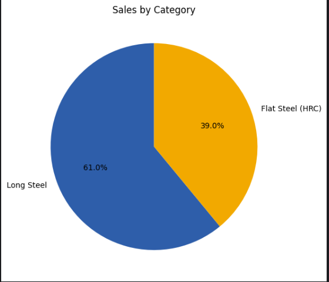
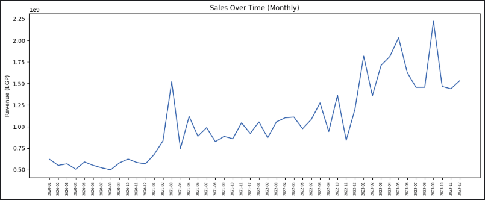
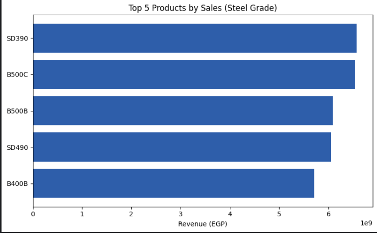
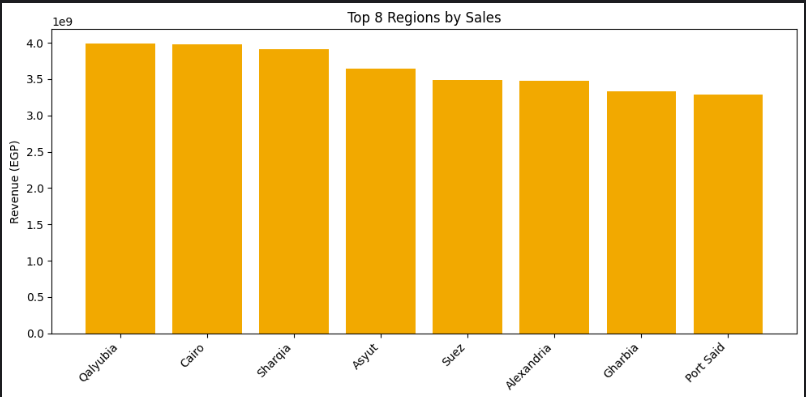

# 📊 Task 1 — EzzSteel Sales Data Analysis

Basic sales data analysis project: cleaning, exploratory analysis, and visualization of steel sales transactions.

## 📁 Dataset

| Item | Detail |
|---|---|
| Source file | `EzzSteel_Full_Dataset.xlsx` |
| Sheet used | `Sales_Transactions` (2,408 records) |
| Supporting sheet | `Monthly_Financial` (used only to estimate profit margins) |

## 🛠️ Tools Used

| Tool | Purpose |
|---|---|
| Python (Pandas) | Data cleaning and analysis |
| Matplotlib | Data visualization |
| Jupyter / Kaggle Notebook | Development environment |

## 🧹 Data Cleaning & Validation

| Issue | Rows Affected | Fix Applied |
|---|---|---|
| Duplicate rows | 8 | Removed |
| Mixed date formats (YYYY-MM-DD / DD/MM/YYYY) | 9 | Standardized to datetime |
| `Revenue_EGP` stored as text | 7 | Converted to numeric |
| Negative `Quantity_Tons` | 11 | Converted to absolute value |
| Unit mismatch (kg vs ton) in `Quantity_Tons` | 13 | Divided by 1000 |
| Missing `Quantity_Tons` | 22 | Filled with median |
| Invalid `Discount_%` (>100%) | 11 | Set to null |
| Inconsistent text casing (`Customer_Segment`, `Product_Type`) | 28 | Standardized |
| Missing `Governorate` (export sales) | 692 | Mapped `Region` from `Country` |

## 📊 Charts

Four charts created in the notebook:

| Chart | Type | Shows |
|---|---|---|
| Sales by Category | Pie Chart | Long Steel vs Flat Steel (HRC) share of total sales |
| Sales Over Time | Line Chart | Monthly revenue trend, 2020–2023 |
| Top Products | Horizontal Bar Chart | Top 5 steel grades by sales |
| Sales by Region | Bar Chart | Top regions by sales |

*(Power BI dashboard not included in this task — notebook-based charts only.)*

## 💡 Insights

| # | Insight |
|---|---|
| 1 | Long Steel dominates the product mix at 61.3% of total sales (30.6B EGP) vs. Flat Steel (HRC) at 38.7% (19.3B EGP). |
| 2 | B500C is the top-selling product grade (6.49B EGP), closely followed by SD390 (6.40B EGP) — no single grade dominates. |
| 3 | Sales are geographically balanced; the top region (Qalyubia) accounts for only 7.9% of total sales. |
| 4 | Sales grew ~4.5x from the lowest month (Aug 2020, 498.5M EGP) to the highest (Sep 2023, 2.22B EGP). |
| 5 | Estimated profit margin stayed stable (13–16%) across the four-year period, indicating consistent cost control. |

Full breakdown with figures: see `Insights.txt`.

## 📂 Structure

| File / Folder | Description |
|---|---|
| `EzzSteel_Full_Dataset.xlsx` | Original dataset |
| `MerveBozan.ipynb` | Full notebook (cleaning, analysis, charts) |
| `/images` | Exported chart images (PNG) |
| `Insights.txt` | Summary of key figures and insights (EN/TR) |
| `README.md` | This file |

## ✍️ Author

**Merve**