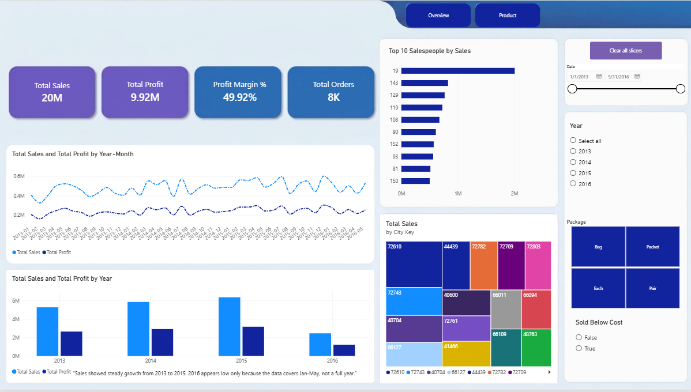
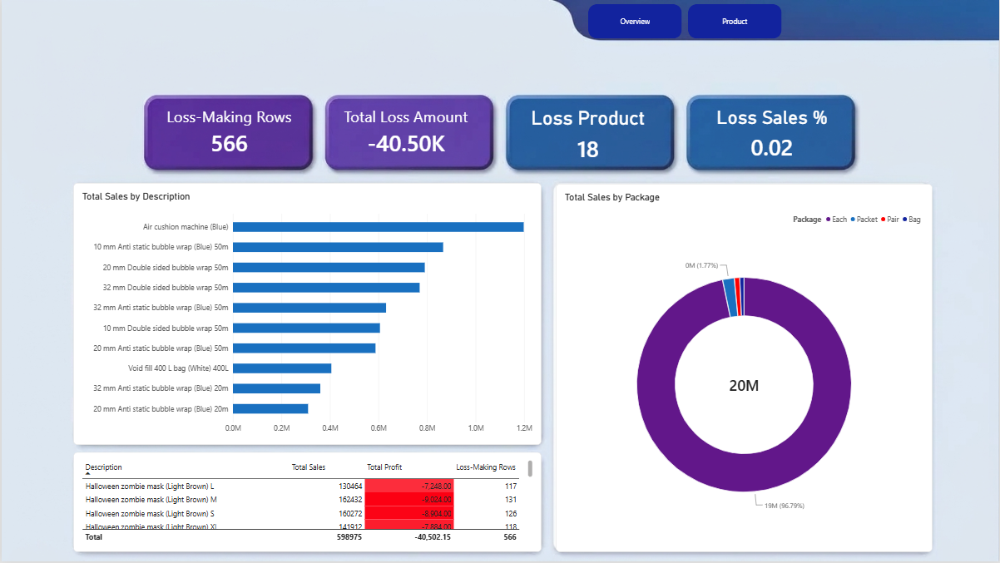

# 📊 WWI Sales Data Analysis

Retail sales data analysis for **Wide World Importers**, covering data cleaning, validation, an interactive Power BI dashboard, and business insights.

---

## 📁 Dataset

- **Source:** `FactSale.csv` — 26,397 rows, 21 columns
- **Content:** Individual sales transactions (invoice date, customer, product, quantities, pricing, tax, and profit fields)

---

## 🛠️ Tools Used

- **Python (pandas)** — data cleaning & validation
- **Power BI** — interactive dashboard
- **PDF (.pdf)** — Key Insights & Data Quality Summary reports

---

## 🧹 Data Cleaning & Validation

Key issues identified and how they were handled (full detail in `Data_Quality_Summary.docx`):

| Issue | Finding | Decision |
|---|---|---|
| Date format | Text instead of datetime | Converted to datetime |
| Missing delivery date | 13 rows | Flagged, not deleted |
| Customer Key = 0 | 9,077 rows (34.4%) | Documented as retail sale |
| Tax Amount deviation | 253 rows, fixed -0.01 | Documented, not corrected |
| Negative Profit | 566 rows, 87% from one product | Flagged & escalated |

---

## 📊 Dashboard Overview

The Power BI dashboard has 2 pages:

1. **Sales & Profit Overview** — Sales & Profit trends, KPIs, year-over-year comparison, salesperson leaderboard
2. **Product Performance** — Top products, loss-making products, package-type distribution

<!-- To add images:
     1. Create an "images" folder in this repo
     2. Upload your Power BI screenshots there
     3. Replace the filename below with your image's name -->




---

## 💡 Key Insights

Full details in `KeyInsights.pdf`. Highlights:

- Sales grew steadily 2013–2015; profit margin held stable at ~50%.
- **Halloween Zombie Mask** is sold at a loss on 100% of its sales (price 18 vs. cost 19) — the single biggest driver of negative profit.
- Sales are concentrated among a small group of top-performing salespeople.

---

## 📂 Repository Structure

```
├── FactSale.csv                   				   # Original raw dataset
├── cleaned_fact_sale.csv             				   # Cleaned dataset
├── retail-sales-data-cleaning-bi-dashboard.ipynb                  # Cleaning & validation notebook
├── KeyInsights.pdf              				   # Business insights report
├── Data_Quality_Summary.pdf        				   # Data quality documentation
├── images/                         				   # Dashboard screenshots
└── README.md
```

---

## ✍️ Author

Built as a learning project to practice data cleaning, validation, and dashboarding end-to-end.