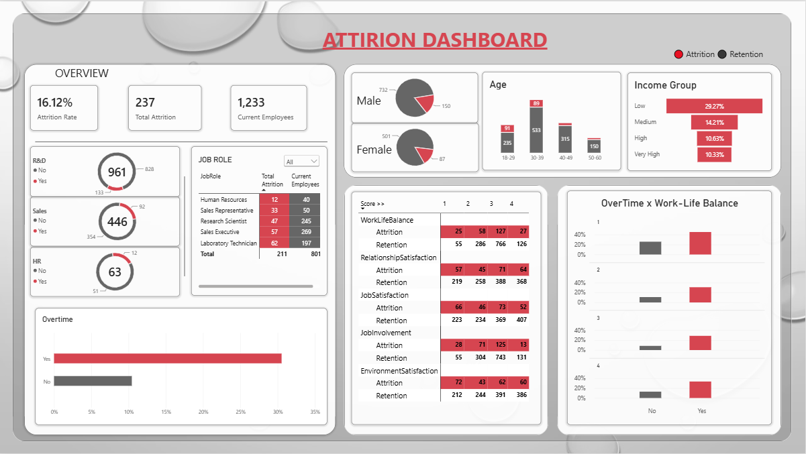

# 📊 HR Employee Attrition Analysis & Dashboard

End-to-end HR attrition analysis and Power BI dashboard built on the IBM Watson HR Employee Attrition dataset — from data cleaning to interactive dashboard.
IBM Watson HR Employee Attrition veri seti üzerine, veri temizlemeden interaktif dashboard'a kadar uçtan uca bir İK (attrition) analizi ve Power BI projesi.

---

## 📁 Dataset

| Property | Detail |
|---|---|
| Source | IBM Watson HR Employee Attrition Dataset |
| Rows | 1,470 employees |
| Columns | 35 (32 after cleaning) |
| Target variable | `Attrition` (Yes / No) |
| Overall attrition rate | 16.12% |

---

## 🛠️ Tools Used

| Tool | Purpose |
|---|---|
| Python (Pandas, Matplotlib) | Data cleaning, feature engineering, exploratory analysis, visualization |
| Jupyter Notebook | Step-by-step analysis workflow |
| Power BI Desktop | Interactive dashboard, DAX measures, data modeling |
| DAX | Attrition Rate, Total Attrition, Current Employees measures |

---

## 🧹 Data Cleaning & Validation

- Dropped 3 zero-variance columns: `EmployeeCount`, `Over18`, `StandardHours`
- Created `AttritionFlag` (0/1 numeric column) from the `Attrition` Yes/No field
- Built `AgeGroup` (18-29, 30-39, 40-49, 50-60) and `IncomeGroup` (Low/Medium/High/Very High) bins
- Added `AgeGroupSort` and `IncomeGroupSort` companion columns to enforce logical ordering in Power BI (overriding default alphabetical sort)
- Built `TenureGroup` bins (0-2, 3-5, 6-10, 10+ years) to analyze new-hire risk
- Reshaped 5 satisfaction columns from wide to long format (Unpivot) for the Survey Score matrix visual

---

## 📊 Dashboard Overview

| Section | Visuals |
|---|---|
| Overview | KPI cards (Attrition Rate, Total Attrition, Current Employees), Department donuts, Job Role Top 5 table |
| Demographics | Gender donuts, Age Group stacked column chart |
| Drivers | OverTime bar chart, Income Group funnel, Survey Score matrix (5 satisfaction factors), OverTime × Work-Life Balance small multiples |

---

## 💡 Key Insights

- **OverTime is the strongest single driver of attrition** — employees working overtime leave at ~3x the rate of those who don't (30.5% vs 10.4%).
- **Income strongly predicts attrition** — the lowest income group leaves at ~2.8x the rate of the highest income group (29.3% vs 10.3%).
- **Performance rating has no effect** — average performance scores are nearly identical between employees who left and stayed (a null finding).
- **Job Involvement shows the cleanest relationship** — attrition declines steadily and consistently as involvement rises.
- **Combined effect** — even a high work-life balance score doesn't offset overtime; the OverTime effect dominates at every WLB level.
- **New hires are the highest-risk segment** — employees with 0-2 years of tenure show the highest attrition rate.
- **Sales Representative is the highest-risk role** at 39.8% attrition, well above every other position.

---

## 📂 Repository  Structure

├── cleaned_employee_attrition.csv                                 # Cleaned dataset used in Power BI
├── employee-attrition-data-analysis.ipynb                         # Python cleaning & EDA notebook
├── Employee Attrition_task3.pbix                                  # Power BI dashboard file
├── Insight_Task3.docx                                             # Business insights report
├── images/                                                        # Charts & dashboard screenshots
└── README.md
---

## ✍️ Author

**Merve**